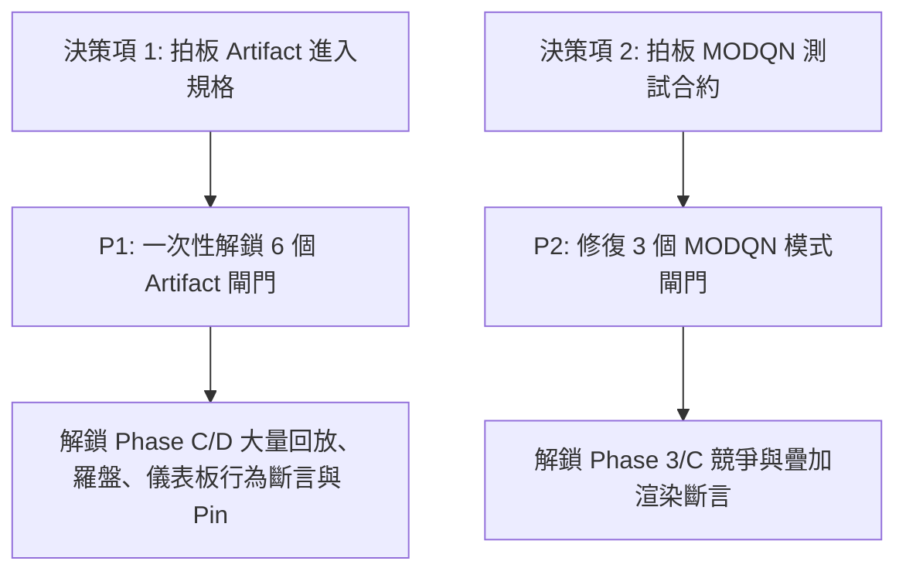

身為資深偵錯與優先序規劃員（**E3**），依據不可協商的紀律，在不具備 repo 讀取與指令執行權限下，**嚴格基於內嵌材料與既有事實**，為您提供這 9 個未處置閘門的先例適用性分析、處置優先序與 Owner 決策邊界報告。

---

# 一、 先例適用性逐個判定（針對 9 個未處置閘門）

### 核心結論：
**第 3 點先例（改入口為 `/legacy`）「完全不能」直接套用到這 9 個閘門。**
先例成立的前提是「該功能在首頁關閉，但在 `/legacy` 仍正常運作」；但本批 9 個閘門的面臨的是**結構性路由阻斷**或**儲存防禦重設**，換成 `/legacy` 一樣無法通過。

---

### 群組一：6 個 Artifact Replay 閘門（共因：`App.tsx:403` 路由強制覆寫）

| # | Validator 名稱 | 判定結果 | 關鍵依據與為什麼不能套用先例 |
|---|---|:---:|---|
| 1 | `validate:phase-c:director-cinematic:browser` | **不能套用先例** (需 Owner 決策入口規格) | 依據事實 1 與材料 G1，`src/App.tsx:403` 判定 `isLegacyWalkerRoute ? 'live-sim' : readSceneSourceFromUrl()`，而 `isLegacyWalkerRoute` 同時包含 `/`、`/legacy`、`/walker`。即使把入口改成 `/legacy`，依然會被強制判定為 `live-sim`，無法掛載 `artifact-replay-sidebar`。此為**活程式碼被常規入口封鎖**。 |
| 2 | `validate:phase-c:artifact-satellite-compass:browser` | **不能套用先例** (需 Owner 決策入口規格) | 同上。掛載條件 `sceneLane === 'artifact-replay' && replaySceneFrame` 在 `/` 與 `/legacy` 下均因 `sceneSource` 被強制轉回 `live-sim` 而無法達成。 |
| 3 | `validate:phase-c:artifact-scene:real-data:browser` | **不能套用先例** (需 Owner 決策入口規格) | 同上。首個 predicate 即卡在等待 `artifact-replay-sidebar` 載入，`/legacy` 無法解套。 |
| 4 | `validate:phase-c:artifact-fail-closed:browser` | **不能套用先例** (需 Owner 決策入口規格) | 同上。留在 live lane 時 `shouldRenderMainScene` 保持 true，永遠不會進到 fail-closed surface。 |
| 5 | `validate:phase-d:dashboard:real-data:browser` | **不能套用先例** (需 Owner 決策入口規格) | 同上。資料 provenance 判斷前即卡死在 sidebar loaded。 |
| 6 | `validate:phase-d:dashboard:browser` | **不能套用先例** (需 Owner 決策入口規格) | 同上。artifact 專屬的 `AlgorithmDashboard` 掛載分支無法觸發。 |

---

### 群組二：3 個 MODQN Demo 閘門（共因：`localStorage` 被防禦性重設）

| # | Validator 名稱 | 判定結果 | 關鍵依據與為什麼不能套用先例 |
|---|---|:---:|---|
| 7 | `validate:phase-c:sinr-serving-mosaic:browser` | **不能套用先例** (證據不足 / 測試手段遭阻斷) | 依據事實 2，`resolveHomepageInitialRuntimeState`（`src/app/appRuntimeModel.ts:120`）刻意抹除 `localStorage` 中的 `modqn-demo`。無任何證據顯示 `/legacy` 能避開此初始化防禦，亦無證據顯示功能被移除，屬於**測試 harness 使用的私有注入管道被產品防禦封鎖**。 |
| 8 | `validate:phase-3:contention-render:browser` | **不能套用先例** (證據不足 / 測試手段遭阻斷) | 同上。依賴 `localStorage` 切換模式，進場即被 reset 回預設值。 |
| 9 | `validate:phase-3:overlay-render:browser` | **不能套用先例** (證據不足 / 測試手段遭阻斷) | 同上。無法透過既有 `localStorage.setItem` 途徑進入目標 lane。 |

---

# 二、 處置優先序規劃（依「解鎖量」排序）

當前有 62 條行為斷言提案與 58 條 pin 歸屬卡在紅閘門，處置應以**批次效益最大化**為原則：

### 優先級 P1（解鎖量最大，共 6 個閘門）
* **標的**：`director-cinematic:browser`、`artifact-satellite-compass:browser`、`artifact-scene:real-data:browser`、`artifact-fail-closed:browser`、`dashboard:real-data:browser`、`dashboard:browser`
* **原因**：這 6 個閘門的元件與邏輯**全為活程式碼**，失敗原因 100% 同源於 `App.tsx:403`。只要 Owner 敲定入口規則（見第三節），修改一處即可**一口氣轉綠 6 個閘門**，直接釋放 Phase C / Phase D 絕大多數的行為斷言阻礙。

### 優先級 P2（次要解鎖，共 3 個閘門）
* **標的**：`sinr-serving-mosaic:browser`、`contention-render:browser`、`overlay-render:browser`
* **原因**：影響 Phase 3 與 Phase C 的渲染疊加與 mosaic 驗證。需待 Owner 明確 MODQN demo 的官方喚起合約（URL param 或專屬路徑）後，同步更新 3 個 validator 測試腳本的進場方式。

---

# 三、 必須由 Owner 拍板的決策清單

身為規劃員，嚴守權責邊界，以下架構與產品意圖決策**絕對不可由工程代拆代判**：

### 決策項 1：Artifact Replay 的正式路由合約（解鎖 P1）
`src/App.tsx:403` 的 `isLegacyWalkerRoute ? 'live-sim' : readSceneSourceFromUrl()` 是刻意忽略 query，還是遺留邏輯？
* **選項 A（推薦）**：首頁尊重 query 參數。修改 `App.tsx:403`，允許在指定 URL 帶有 `?sceneSource=artifact-replay` 時提升優先權，進入 artifact lane。
* **選項 B（路由隔離）**：首頁維持強制 `live-sim`，但為 artifact 模式定義專屬路由（例如利用 fallthrough 路由或新增 `/replay` 路由），並全面將 6 個 validator 遷移至該正式路由。

### 決策項 2：MODQN Demo Mode 的合法喚起途徑（解鎖 P2）
`src/app/appRuntimeModel.ts:120` 明確防禦了 `localStorage` 殘留，表明產品「不允許隱式 storage 污染」。
* **選項 A**：提供標準 URL 啟動參數（例如支援 `?appMode=modqn-demo` 或 `?demo=modqn`），讓自動化測試不再依賴注入 `localStorage`。
* **選項 B**：若 MODQN Demo 已遷移至特定子頁面或專用 Sandbox（如類似 `/walker` 的獨立載案），請 Owner 給出正式入口位址。

---

# 四、 紀律檢驗：證據不足項目清單（針對 MODQN 3 閘門）

若要在不更動產品防禦（不關閉 `resolveHomepageInitialRuntimeState`）的前提下修復 MODQN 3 閘門，目前材料**證據不足**，具體缺失以下資訊：
1. **合法啟用路徑**：現行程式碼中，是否有任何合法的 UI 互動（如 Settings/Drawer 切換開關）或 URL 查詢參數可觸發 `appMode = 'modqn-demo'`？
2. **路由分配細節**：`main.tsx` 的 fallthrough 或其他未列出的路由，是否有專屬承載 MODQN runtime 的元件？
3. **測試目標生命週期**：`modqn-demo` 是否仍為當前活動功能，抑或已排定進入下一波遷移/退休流程？
