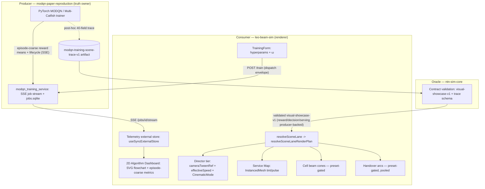
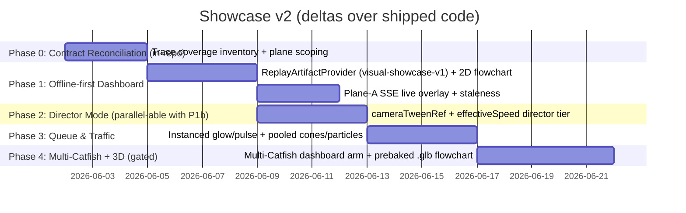

# Master SDD v2: Dynamic Showcase, Algorithm Dashboard & Multi-Catfish Roadmap

> **Status:** IMPLEMENTATION AUTHORITY (supersedes the v1 draft `docs/showcase-master-sdd.md`).
> **Provenance:** v1 draft + the multi-axis review `docs/showcase-master-sdd-review.md` + four independent agent reviews under `check/{opus,codex,pro,gemini}.md`, reconciled against the shipped codebase. v1 is retained as the original-intent record; this v2 is what implementation follows.
> **Date:** 2026-06-02.
> **Why v2 exists:** v1 was authored blind to four shipped truth-anchors it directly touches — `docs/frontend-render-governance.md` (lane matrix + Rule#9), `src/scene/modqnVisualLayers.ts` (the preset taxonomy), `src/usePlaybackControls.ts` (`effectiveSpeed`), and **`docs/decisions/ADR-002-...md` + `src/modqn/training-scene-trace/`** (the producer-owned training-trace contract). v2 binds every layer to that infrastructure instead of building parallel architecture, and corrects three concrete code misreads in the reviews themselves (see §0.2).

---

## 0. Reconciliation Ledger

### 0.1 What every review agreed on (now binding)

1. **Repo-ownership fix.** v1 §2 puts the PyTorch DRL/Telemetry engine inside `ntn-sim-core`. Wrong. MODQN training is owned by **`modqn-paper-reproduction`**; `ntn-sim-core` is the validation oracle; `leo-beam-sim` is the renderer. (all 4 reviews)
2. **Transport is SSE, not WebSocket.** Shipped path is `EventSource` → `GET /jobs/{id}/stream` (`src/ui/modqn-training/JobsPanel.tsx:268`, `serviceClient.ts:190`). (opus, codex)
3. **The live stream is episode-coarse, not per-step.** `TrainingProgressEvent.metrics?: Record<string, number>` (`src/modqn/training-trigger/types.ts:253`) is a generic record carrying episode-level reward means + lifecycle events. There is no per-step loss / Pareto / weights feed. (opus, codex)
4. **No React-driven high-frequency SVG/3D mutation.** Bind by ref + `rAF`/CSS/instanced attributes; never per-step React re-render. (all 4)
5. **100-UE is feasible because instancing already exists** (`src/viz/GroundScene.tsx:129 SecondaryUeInstances`, `InstancedMesh`). (opus, codex, pro, gemini)
6. **Phase-4 runtime `ExtrudeGeometry` on 200+-shape SVGs is a jank/leak trap.** Defer + prebake. (all 4)

### 0.2 Corrections to the reviews themselves (verified against code)

| # | Review claim | Verified reality | Effect on v2 |
|---|---|---|---|
| C1 | opus.md: "the camera lerp/slerp engine is net-new" | **False.** `src/scene/MainScene.tsx:292 cameraTweenRef` + `:640-682` already lerp `camera.position` and `controls.target` over `CAMERA_TWEEN_DURATION_MS` with easing, inside the render loop. `useCameraControls.ts` is only a thin preset-dispatch hook. (codex was right) | Director Mode **extends `cameraTweenRef`**, it does not build a new tween engine (§5). |
| C2 | opus.md implied 0.05x can just lower `effectiveSpeed` | **Imprecise.** `src/usePlaybackControls.ts:5 HANDOVER_FOCUS_SPEED = 1`; `:30 effectiveSpeed = autoSlowApplied ? Math.min(speed, 1) : speed`. The existing auto-slow *caps* at **1×** (`Math.min`, not a floor); 0.05× is below anything that path produces. (codex was right) | Director adds a **new speed tier** to the single `effectiveSpeed` chain (§5.3), not a second multiplier and not a reuse of the 1× cap. |
| C3 | opus.md missed it entirely | **`ADR-002` + `src/modqn/training-scene-trace/{contract,inventory,producerHandoff,artifactTarget}.ts` already exist.** The schema name `modqn-training-scene-trace-v1` is the constant `MODQN_TRAINING_SCENE_TRACE_SCHEMA_VERSION` in `artifactTarget.ts:6`; the producer-owned 40-field requirement registry is in `contract.ts`; `training-run-replay` / `model-comparison-replay` are scaffolded as `future-lane`; plus 6 `validate:modqn:training-scene*` validators. (codex was right) | Phase 0 is **not** a green-field contract; it is a *coverage reconciliation* against an existing contract (§3, §6). |
| C4 | gemini.md proposed 30Hz backpressure for a "hundreds-of-Hz push" | The per-step push **does not exist** to be back-pressured. | The ring-buffer/coalesce design is kept but re-scoped to the *future* per-step plane, not the current episode-coarse one (§3.4). |

### 0.3 Unique contributions merged from each review

- **opus** — preset-taxonomy mapping; the §5.1 "fake-motion" loophole; render-plan-routed mermaid; heartbeat-vs-progress staleness (`producer api.py:817` heartbeat verified); per-phase named validators.
- **codex** — `ADR-002` + training-scene-trace contract; `cameraTweenRef`; `HANDOVER_FOCUS_SPEED=1`; per-metric provenance fields; `useSyncExternalStore` external store.
- **pro** — `ReplayArtifactProvider` auto-fallback to `visual-showcase-v1.json` on disconnect; build-time SVG→`.glb` prebake; offline-first Phase 1 split.
- **gemini** — telemetry coalescing + ring buffer (future per-step plane); object pool for cones/arcs (`visible=false`, never per-frame `dispose()`); **dt-must-scale-with-speed** correctness binding.

---

## 1. Traceability: User Intent vs v2 Design

### 1.1 User Original Requirements (unchanged from v1 §1.1)

High-density 100-UE legibility; absolute MODQN integration *proof* (not hardcoded animation); live interactive training; 2D algorithm flowchart with dynamic data flow; Director Mode (auto camera tour + time-dilation); `[Intra-HO Focus]` / `[Inter-HO Focus]` buttons; Multi-Catfish extensibility; per-UE queue/traffic; leverage `research-visual-lab` SVGs.

### 1.2 v2 Design (corrected)

- **Dual-axis macro/micro, preset-gated.** Macro = 100-UE instanced ground tint by serving satellite (Baseline Faithful). Micro = focused cones + flash arcs, mounted by **selecting the `explain-handover` preset**, never by camera zoom or `appMode`+play (§4, §7-R4).
- **2D flowchart bound to real event boundaries.** Edge/node animation keys to emitted stream events (episode ticks) via ref+`rAF`/CSS, never a free-running render clock; ids with no emitted source render idle, not animated (§3.4, §7-G1).
- **Director Mode = delta over shipped engines.** Extends `cameraTweenRef` (camera) + adds a director tier to `effectiveSpeed` (speed) + extends `CinematicMode` (`src/scene/types.ts:23`) (§5).
- **Queue/traffic is source-owned, not display-invented.** Queue depth must come from a producer trace / validated traffic generator / vendored `ntn-sim-core/src/core` module; absent ⇒ source gap, not a pretty backlog (§4.3, ADR-002 §"Infer Training Trace Inside leo-beam-sim" → rejected).
- **Live-defense fallback.** On telemetry loss, auto-degrade to a validated `visual-showcase-v1` replay rather than a dead "Offline" badge (§7-G2).

---

## 2. Master Architecture (corrected)



Two rules the diagram encodes that v1 violated:

1. **No 3D layer reads `SimState`/`appMode` directly.** Enablement flows through `resolveSceneLane` (`src/app/sceneLane.ts:16`) → `resolveSceneLaneRenderPlan` (`src/scene/sceneLaneRenderPlan.ts:68`). (Rule#2, Rule#9)
2. **Target lane is `modqn-live-cell-preview` only.** `sinr-live` keeps its own beam path; `modqn-replay-proof` and `artifact-replay` must stay clean of these overlays.

---

## 3. Data Contract & Truth Planes (the core v2 addition)

There are **three** distinct data planes. v1 collapsed them into one fictional "real-time WebSocket". They must never be cross-fed.

### 3.1 Plane A — Live training progress (SSE, episode-coarse)

- Source: `modqn_training_service` SSE `GET /jobs/{id}/stream`; consumer `JobsPanel.tsx:268`.
- Carries: `scalarReward`, `r1Mean`/`r2Mean`/`r3Mean`, `totalHandovers`, `episode`/`episodeBudget`, and lifecycle (`queued`/`heartbeat`/`progress`/`done`/`failed`/`cancelled`). Type today: `TrainingProgressEvent.metrics?: Record<string, number>` (`types.ts:253`).
- **NOT carried:** per-step loss, Pareto front, network weights, learning rate (those are *inputs* in `allowlist.py`/`config_writer.py`, never emitted). The dashboard MUST tag these channels "requires producer change" and render them as source gaps until the producer emits them.

### 3.2 Plane B — `modqn-training-scene-trace-v1` (producer artifact, post-hoc)

- Defined by `ADR-002`; the schema name `modqn-training-scene-trace-v1` is the constant in `src/modqn/training-scene-trace/artifactTarget.ts:6`, and the 40-field requirement registry (`provenance`/`environment`/`entities`/`step`/`comparison`) is in `contract.ts`. Owned by `modqn-paper-reproduction`.
- This is the source for the future `training-run-replay` and `model-comparison-replay` lanes (currently `sceneLane: 'future-lane'` in `contract.ts`).
- `step.reward`, `step.policyDiagnostics`, `step.activeBeamSchedule`, `step.angleAwareTerms` etc. are **producer-owned, source-gap-when-absent**. Only `step.focusUe` and `step.sourceGaps` are `displayDerivedAllowed`.

### 3.3 Plane C — `visual-showcase-v1` (validated display replay; the fallback)

- Per `src/modqn/training-scene-trace/inventory.ts`, `visual-showcase-v1` is the **richest currently-available source**: `step.reward`, `step.policyDiagnostics`, `step.allUePositions`, `step.allUeServingHistory`, `step.previousServing`/`selectedServing`/`selectedAction`, `step.beamFootprints`, `environment.frequencyReuse` are all `producer-backed`.
- Therefore the live-defense fallback (§7-G2) is not a downgrade — it is the most complete decision/reward story we can show offline, already validated by `ntn-sim-core`.

### 3.4 Coalescing & binding (replaces v1's "React render intervals")

- Plane A events arrive at most once per episode → bind flowchart edge pulses to **event boundaries**, label the cadence "episode-paced". No free-running timer.
- For the *future* per-step plane (Plane B streamed live, if the producer ever emits it): coalesce to one representative frame per `rAF` via a ring buffer; surface the true coalesced count ("epoch N, +K updates"); the dash period is a display constant, **not** a data-rate encoding. (gemini's backpressure idea, re-scoped.)
- State management: a small **external store consumed via `useSyncExternalStore`** with a `subscribe` transient path that mutates DOM refs directly; React Context only passes the store handle. (codex/pro/gemini converge here; Zustand is *not* a dependency — do not add it; the established coarse-state precedent is the memoized `ModqnEnvelopeContext` in `runtimeContext.ts`.)

### 3.5 Provenance & staleness invariants (binding)

- **INV-1:** a `visual-showcase-v1` / replay envelope MUST NEVER back a panel labeled "live training", and a Plane-A SSE value MUST NEVER persist into a replay reward channel. Every reward/metric tile declares its plane.
- **INV-2:** staleness ≠ disconnect. While `status=running`, if heartbeats continue but no `progress` event arrives for N seconds, metric tiles flip to "Telemetry Stalled" (freeze-grey), distinct from "Offline". Compute `nowMs − tsMs(last progress event)`; the producer already emits a 10 s heartbeat server-side (`api.py:817`) and trainer-side (`worker.py:248`), so no producer change is needed. (`docs/showcase-master-sdd-review.md` R5.)
- **INV-3:** per ADR-002, `leo-beam-sim` MUST NOT synthesize active/next beam schedules, reward terms, policy diagnostics, EE terms, or comparison alignment. Absent ⇒ source gap.

---

## 4. Visual Layer Specs (preset-mapped, instanced)

| Layer | Preset (`src/scene/modqnVisualLayers.ts`) | Lane | Render technique |
|---|---|---|---|
| 100-UE macro tint | `baseline-faithful` (default) | `modqn-live-cell-preview` | `InstancedMesh` + `setColorAt`; tint via instanced color attribute (`GroundScene.tsx:129`) |
| Queue depth pulse/glow | `baseline-faithful` | same | **instanced attribute + single `ShaderMaterial` `uTime` uniform** (NOT per-UE material; `emissiveIntensity` is one shared scalar so glow-radius needs `onBeforeCompile`). Update queue/service values at 10–15 Hz, not per frame. |
| All-serving cones (low-opacity) | `service-allocation` | same | preset-gated; tinted per serving sat |
| Focus cones (0.18) + flash arcs | `explain-handover` | same | preset-gated; Director **selects** this preset (§5), zoom does not raise cones |
| Upload particles | `explain-handover`, focused only | same | one `THREE.Points`/`InstancedMesh` per cone; motion+opacity from `uTime`; caps in §8 |
| 3D queue cylinder | `explain-handover`, focused only | same | single `CylinderGeometry` scaled by a height uniform, not stacked meshes |

`modqn-replay-proof` and `artifact-replay` mount **none** of these overlays. (`src/scene/modqnVisualLayers.ts` also defines a 4th preset, `debug`, for diagnostic surfaces; the showcase layers above do not use it.)

---

## 5. Director Mode (delta over shipped engines)

### 5.1 Reuse, don't rebuild

- **Camera:** extend `cameraTweenRef` (`MainScene.tsx:292,640-682`). It already lerps position+target with easing in the render loop. Director adds: target = focused UE, configurable duration, and an explicit ownership state machine.
- **Cinematic:** extend `CinematicMode` (`scene/types.ts:23`, currently `'off' | 'spotlight'`) with a director state rather than a parallel flag.

### 5.2 OrbitControls ownership state machine (R2 fix)

`idle → acquiring → focused → restoring → idle`, plus user-interrupt `→ cancelled → idle`. On `acquiring`: snapshot camera/target/speed, set `controls.enabled = false`. On `restoring`/`cancelled`: restore snapshot, re-enable controls. Guarantee return-to-OrbitControls on every exit path (v1's own validation already flags "leave controls locked").

### 5.3 Single speed authority (C2 fix)

Add a director tier to the *one* `effectiveSpeed` chain in `usePlaybackControls.ts`:

```
const DIRECTOR_FOCUS_SPEED = 0.05;
effectiveSpeed = directorFocusActive
  ? Math.min(speed, DIRECTOR_FOCUS_SPEED)
  : autoSlowApplied ? Math.min(speed, HANDOVER_FOCUS_SPEED) : speed;
```

No second multiplier, no bypass of `runtimeFrameStep` (`src/scene/runtimeFrameStep.ts:494 state.simTimeSec += deltaSec * speed`). **dt scales with speed automatically** through this chain — this is the correctness binding gemini flagged: visual slow-mo and decision-cycle advance stay locked, because both read the same `effectiveSpeed`.

### 5.4 Trigger discipline (Rule#2 fix)

- `[Intra-HO Focus]` / `[Inter-HO Focus]` buttons are the ONLY trigger for the cone-raise + speed drop. Never `appMode`+play alone.
- Reuse the existing `HandoverEventRail` slow-motion focus gate (`src/ui/HandoverEventRail.tsx:294`, `sourceOwner === 'live-walker' && horizonKind === 'live-walker-window'`) and `deriveHandoverRailSlowMotionFocus`. On `modqn-replay-proof` (no live-walker window) the Director tour is **inert** — slow-mo there would fabricate a source horizon (Rule#8).

---

## 6. Roadmap (re-sequenced, offline-first, validator-gated)



- **Phase 0 (in-repo, no producer dependency):** run `validate:modqn:training-scene-trace-inventory` + read `inventory.ts` to enumerate, per source, what is `producer-backed` vs `source-gap`. Output: the exact channel list the dashboard may show now vs must source-gap. This replaces v1's green-field "define training-telemetry.json".
- **Phase 1 offline-first (pro):** P1a builds the dashboard + flowchart against `visual-showcase-v1` (Plane C, fully producer-backed for reward/decision) so UI dev is unblocked without a live backend. P1b layers the Plane-A live SSE overlay + INV-2 staleness on top.
- **Phase 2** can start after P1a (camera work is independent of telemetry).
- **Phase 4** Multi-Catfish: the producer *training* path already exists (`allowlist.py MultiCatfishV2Config`; consumer arm a5 → `multi-catfish` in `trainingFormModel.ts:144`). The real gate is a **frozen, `ntn-sim-core`-validated multi-catfish replay bundle** (none exists yet) — per CLAUDE.md §3. 3D extrusion is a build-time `.glb` prebake (pro), not runtime `SVGLoader`.

Per-phase **named** validator (Rule#9, browser smoke is necessary-but-not-sufficient):

| Phase | Validator |
|---|---|
| 0 | `validate:modqn:training-scene-trace-inventory` (exists) |
| 1a | extend `validate:phase-d:reward-curve` — assert per-panel plane provenance (INV-1) |
| 1b | new `validate:phase-d:live-telemetry` — fail-closed badge + INV-2 staleness + bounded React re-renders under a synthetic 60 Hz SSE burst + sustained 3D frame timing via `leo-fps-counter` |
| 2 | extend `validate:phase-c:camera-preset` — Director inert where `sourceOwner !== 'live-walker'`; controls always restored |
| 3 | new — particle cap + cell-lane-only assertion |
| 4 | extend `validate:frontend:scene-lane-governance` — Lane Matrix row for the 2D dashboard + (if any) secondary 3D viewport; dispose/no-leak |

---

## 7. Governance Guards (hardened)

- **G1 — No fake numbers, motion, OR state.** (Hardens v1 §5.1.) A render-clock-driven edge pulse with no underlying event is a mock, citing `frontend-render-governance.md:211-212` ("source gap instead of fake hopping animation"). Animate an edge only when a real Plane-A/B event id is present.
- **G2 — Fail-closed with seamless fallback.** (pro/gemini.) On heartbeat loss > 3 s: pause live updates, show the degraded badge, AND auto-switch the viewport to a validated `visual-showcase-v1` replay loop (`ReplayArtifactProvider`). No frozen "live" numbers, no dead page during an oral defense.
- **G3 — Lane isolation + Rule#9.** The 2D dashboard is a NEW truth-bearing surface; §5.3-style prose is not a CI gate. Add a non-3D-surface governance section: owner = training telemetry, must fail closed; extend `validate:frontend:scene-lane-governance` to assert the dashboard imports no `three`/`scene/` symbols and mounts no `<Canvas>` on truth lanes. Live Training mode must unmount replay-lane geometry (gemini, GPU-leak guard).
- **G4 — Render budget.** New per-frame signals (pulse, glow, HUD, particles) MUST be driven by render-loop mutation / GPU uniforms, never React props/state. `GroundScene` prop identity must be stable within a slot (validator-asserted). Note the legitimate exception: `src/scene/useSimulation.ts:465 setVersion` is the deliberate engine frame-publish and must be allowlisted by any "no setState in useFrame" lint.

---

## 8. Performance Caps (binding)

- **CPU per-UE budget (added by the 2026-06-02 tech-debt audit — the one gap the render caps below miss).** The live frame step runs one `computeLinkBudget` + one secondary `HandoverManager` step *per secondary UE per frame* (`src/scene/runtimeFrameStep.ts:774-786 stepSecondaryUeHandovers`, `:438 computeLinkBudget`) — ~99 per frame at the 100-UE default, inside `useFrame`, GPU-independent. The other bullets here cap GPU/draw/particles only; they do NOT cap this. Phase 3 MUST make an explicit decision: measure CPU frame time at 100 UE, and if it exceeds budget **especially under Director slow-mo (0.05×, which keeps 100 live UEs on screen far longer)**, throttle secondary-UE link-budget/HO recompute to a fixed Hz decoupled from render frame rate, or cap fully-simulated secondary UEs (interpolate the rest). Add a CPU-frame-time assertion to the Phase 3 validator. This is an addition to v2, not a prerequisite to starting.
- 100-UE: instanced, ≤ ~2 draw calls; tint/pulse via instanced attribute + `uTime`; service/queue values updated 10–15 Hz.
- Focused particles: **default 96, hard cap 128 per cone, global cap 256**; `THREE.Points`/instanced + shader; `service-allocation`'s all-serving cones must not multiply the global cap.
- Active focused cones ≤ 2.
- Cones/arcs: **object pool**; hide via `visible=false`; never `dispose()`/`new THREE.Mesh()` per frame (gemini, Context-Lost guard).
- Phase-4 extrusion: build-time `.glb` (or parse once on a loading screen), ≤ 10 merged draw calls, `<text>` skipped, shader pre-warmed before mount; dispose geometries/materials/textures on mode switch.

---

## 9. Multi-Catfish Extensibility

The `trainerSubcommand` allowlist (`modqn-paper-reproduction/.../allowlist.py`) and consumer arm map (`trainingFormModel.ts:144`) already accommodate `multi-catfish`. The trace contract reserves `entities.models` + `comparison.*` + `environment.algorithmFlags.multiCatfish` (`contract.ts`). Porting Multi-Catfish = (a) a producer frozen+validated replay bundle, (b) a dashboard arm, (c) `model-comparison-replay` lane activation — **no architecture change**, purely filling the scaffolded `future-lane`.

---

## 10. Open Cross-Repo Decisions (gated on explicit go)

These touch `modqn-paper-reproduction` + `ntn-showcase-stack` authority and are **not** started without sign-off (CLAUDE.md §4 vendor-on-demand / cross-repo rule):

1. Whether/when the producer emits the **per-step Plane-B live channels** (loss/Pareto/qValues) the user's "live training" intent ultimately wants. Until then those tiles are source gaps.
2. Producing the **frozen multi-catfish `visual-showcase-v1`** bundle and validating it in `ntn-sim-core` before Phase 4b.

Everything in Phases 0–3 above is in-repo and needs no cross-repo change.
