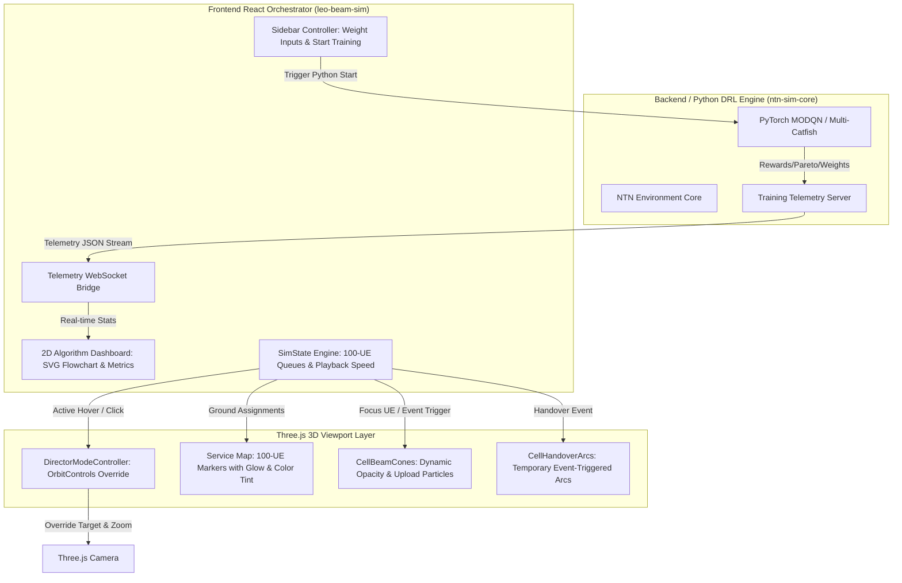
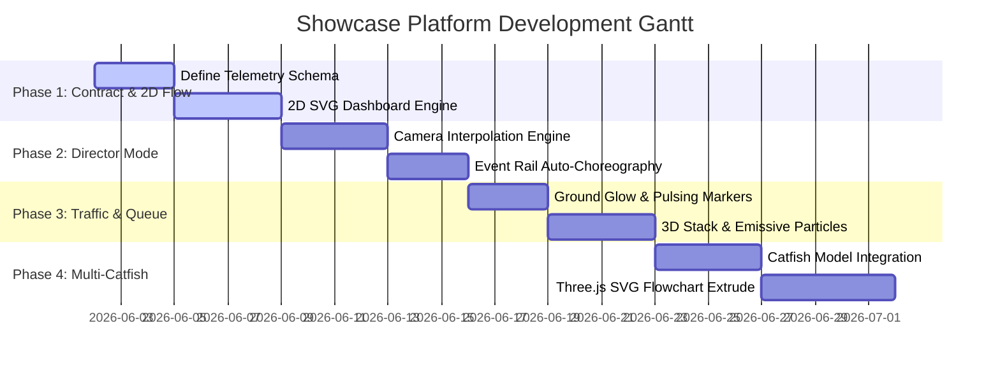

# Master SDD: Dynamic Showcase, Algorithm Dashboard, and Multi-Catfish R&D Roadmap

This System Design Document (SDD) outlines the master system architecture, visual layer specifications, and implementation roadmap for the NTN Showcase Platform. It bridges high-density multi-user visualization, choreographed scene storytelling, live training dashboards, and the future integration of the Multi-Catfish algorithm.

---

## 1. Traceability: Original User Intent vs. AI Recommendations

To ensure absolute fidelity when this document is reviewed by subsequent AI agents, the boundary between the User's original ideas and Antigravity's proposed technical designs is clearly demarcated below.

### 1.1 User Original Requirements (Raw Intent)
* **High-Density Presentation Dilemma**: Transition from the legacy 1-UE SINR scene to a high-density 100-UE environment. The system must demonstrate the benefit of multi-satellite serving and multi-UE service allocation while making individual `intra-satellite` and `inter-satellite` handover events distinct and legible. Other UEs must not feel like static decorative clutter.
* **Algorithm Integration Proof**: Provide absolute visual proof that the "Baseline MODQN" model has been successfully integrated into this repository, rather than just playing hardcoded animations.
* **Live Interactive Training**: Allow parameters to be tuned directly in the sidebar and trigger a "Live Training" process.
* **Algorithm Architecture Visualization**: Instead of restricting the demo to the 3D map, render a 2D network schema/flowchart mapping the model's architecture. Make data flow dynamically across neural network layers, replay buffers, and environment states during the training process to explain the baseline MODQN.
* **Choreographed Camera & Time-Scale Control (Director Mode)**: Use camera tours and script-based movements (zoom in/out, panning) that trigger automatically when the simulation plays. Implement automatic time-dilation (slow-motion) to zoom in and clearly showcase complex `intra-satellite` handovers, which are otherwise hard to observe.
* **Dedicated Showcase Buttons**: Provide two dedicated buttons—`[Intra-HO Focus]` and `[Inter-HO Focus]`—that automate this choreography, zooming in, slowing down, and highlighting the specific event.
* **Multi-Catfish Extensibility**: Establish this architecture as an extensible foundation to easily port the user's advanced **Multi-Catfish** algorithm later, updating both the 3D viewer and the 2D algorithm dashboard.
* **Queue / Traffic Visualization**: Incorporate a data queue concept for each UE. Unserved UEs accumulate packet queue depth; served UEs upload data, showing a decrease in queue size (optionally coupled with data upload animations). This must be integrated without adding to the 3D scene's clutter.
* **SVG Visual Lab Leverage**: Utilize the adjacent SVG AI agent project `~/papers/research-visual-lab` to analyze code structures and generate high-fidelity technical SVGs as the blueprint for the 2D dashboard.

### 1.2 AI Proposed Implementation Details & Design Patterns
* **Dual-Axis Visualization (Macro Ground Colors vs. Micro Spatial Highlights)**:
  * **Macro (Service Map)**: Use the 100-UE ground markers as high-level status dots. Tint each dot based on its currently assigned satellite (color-matched). As assignments shift, ground colors shift dynamically across the board, proving multi-satellite coordination without a single 3D line.
  * **Micro (Handover Events)**: Keep 3D Beam Cones and Handover Arcs hidden by default. Only when an active UE experiences a handover event does the system dynamically "flash" its 3D cone and paraboloid arc (with a 2-3s fade-out ripple), focusing structural complexity only where active events occur.
* **2D Flowchart Interactive Data-Binding**:
  * Represent the MODQN state-action-reward loop as an SVG-based flowchart where nodes (e.g., Policy Network, Replay Buffer, Multi-objective weights) dynamically light up.
  * Connect SVG path properties (`stroke-dasharray`, `stroke-dashoffset`) to React render intervals to mimic data packages flowing through the training loop in real-time.
* **Dynamic Time Dilation (Choreography State Engine)**:
  * Implement a unified `DirectorModeController` that temporarily overrides Three.js `OrbitControls` and the global `speed` multiplier. It uses smooth interpolation (slerp/lerp) to slide the camera to the target UE, drops speed to `0.05x`, raises beam opacity to `0.18`, and restores previous states once the handover event exits the active window.
* **Congestion Heatmap & Queue Stacks**:
  * **Macro Queue (Ground)**: Adjust the "pulsing frequency" and "glow radius" of the 100 ground UE dots to represent queue depth (fast red pulse = congested, stable small green/blue dot = cleared).
  * **Micro Queue (Focused Close-Up)**: When the camera is focused on a specific UE (via Director Mode or user click), render a 3D cylindrical stack (data queue gauge) next to the UE marker. Animate data uploading as floating particles travelling up the translucent 3D Beam Cone.
* **Extensible SVG Extrusion**: Use Three.js `SVGLoader` and `ExtrudeGeometry` to import the AI-generated SVG layout and turn it into a 3D physical circuit/neural flowchart within a secondary 3D viewport, paving a future path for 3D algorithm visualization.

---

## 2. Master System Architecture

The following diagram defines the data flow and boundary separations between the offline PyTorch DRL engine, the Frontend React shell, and the Three.js 3D viewport rendering layer.

---

## 3. Detailed Visual Layer Specifications

### 3.1 100-UE Macro/Micro Service & Queue Legibility
To prevent severe visual clutter in a 100-UE scenario, the render policies are strictly separated based on distance and camera focus state.

| Visual Element | Macro View (Zoomed Out / Global View) | Micro Focus View (Zoomed In / Choreographed Close-Up) |
|---|---|---|
| **UE Markers** | Small color-coded dots representing their currently serving satellite. | Detailed model/sphere with ID tag and physical details. |
| **3D Beam Cones** | **Hidden** to preserve global legibility and prevent screen saturation. | **Visible** for the serving and target satellites at high contrast (opacity `0.18`). |
| **Handover Arcs** | **Hidden** except for temporary 2-second event flashes when a handover occurs. | **Fully Visible** with moving gradient arrows showing directionality and connection progress. |
| **Data Queue Gauge** | Conveyed globally via the **glow radius** and **pulsing frequency** of the ground dots. | Rendered as a physical **3D translucent cylinder stack** beside the UE, shrinking as data uploads. |
| **Data Upload Particles** | **Hidden**. | **Visible** as floating emissive particles traversing upward through the focused Beam Cone. |

---

## 4. Phased R&D Implementation Roadmap

To maintain excellent repo hygiene, avoid massive regression bugs, and enable incremental testing, the development is divided into four sequential phases.

### 4.1 Phase 1: Telemetry Contract & 2D Algorithm Dashboard
* **Objectives**: Establish the data contract between Python training and the JS frontend. Build the 2D flowchart dashboard.
* **Tasks**:
  1. Define `training-telemetry.json` structure mapping Pareto points, reward trends, network weights, active episode, and learning rates.
  2. Implement a WebSocket/SSE client inside `leo-beam-sim` to ingest the training stream.
  3. Load an AI-generated SVG representation of the MODQN algorithm structure (using assets from `~/papers/research-visual-lab`).
  4. Dynamically animate SVG nodes and path flows using CSS and SVG line transitions representing training updates.
* **Validation**: Lints must pass, and the 2D dashboard must run smoothly at 60 FPS without impacting the parallel 3D canvas render.

### 4.2 Phase 2: Director Mode & Handover Showcase Scripts
* **Objectives**: Automate camera运鏡 (interpolation) and slow-motion time-dilation for legibility.
* **Tasks**:
  1. Build a `DirectorModeController` capable of overriding `OrbitControls` targets, FOV, and zoom values via smooth bezier transitions.
  2. Integrate showcase trigger scripts for `[Intra-HO Focus]` and `[Inter-HO Focus]` buttons.
  3. Implement temporal time-dilation: temporarily drop simulator playback speed to `0.05x` during focus, raising it back to normal after handover completion.
  4. Connect the existing `HandoverEventRail` so clicking any row automatically triggers the Director Tour for that specific UE.
* **Validation**: Phase I + II browser smoke tests must verify camera transitions do not crash Three.js contexts or leave controls locked.

### 4.3 Phase 3: Queue & Traffic Visualization (Congestion/Flow)
* **Objectives**: Render macro buffer indicators and micro upload flows to clarify high-density UE traffic behavior.
* **Tasks**:
  1. Modify ground UE markers to support dynamic glow filters and pulsate according to their queue depth (red high frequency = congested, blue/green stable = clear).
  2. Implement the 3D Close-Up Queue Stack: render a vertical translucent cylinder gauge next to the focused UE.
  3. Create an emissive particle shader that sends glowing particle objects ascending along the inside of the active Beam Cone during data transfer.
* **Validation**: Validate frame rendering times. Particle objects count must remain capped (e.g. max 200 per focused cone) to ensure zero WebGL stuttering.

### 4.4 Phase 4: Multi-Catfish Integration & 3D Algorithm Extrusion
* **Objectives**: Showcase the proprietary **Multi-Catfish** algorithm and transition the flowchart dashboard to 3D.
* **Tasks**:
  1. Integrate the Multi-Catfish algorithm contract into both the 3D viewer and the 2D flowchart dashboard, rendering its collaborative swarm and catfish perturbation modules.
  2. Use Three.js `SVGLoader` to parse the `research-visual-lab` SVG layouts.
  3. Use `ExtrudeGeometry` to turn the 2D flowchart nodes into a physical, glowing 3D circuit board floating alongside the satellite planetarium.
* **Validation**: Comprehensive multi-lane render governance verification. Assert that switching modes does not trigger memory leaks or shader compilation locks.

---

## 5. Development Hygiene & Governance Guards

1. **Academic Rigor First**: Telemetry representing training convergence, reward schedules, and Pareto curves must remain source-backed or bound to actual mathematical results from `ntn-sim-core` or generated training runs. Fake numbers to satisfy display needs are strictly prohibited.
2. **Fail-Closed Presentation Bounds**: If a training run or telemetry stream disconnects, the 2D flowchart and the 3D Director Mode must handle the state gracefully (showing a "Telemetry Pending / Offline" badge) rather than crashing or freezing the page.
3. **Decoupled Viewports**: The 2D Training Flowchart and the 3D World Viewport must maintain strict lane isolation. Do not pass direct three.js element references through the React context. Communicate state changes solely through light-weight data primitives.
